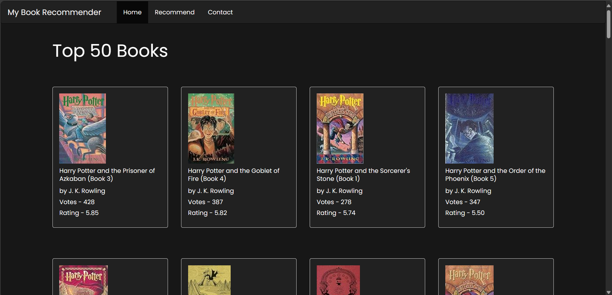
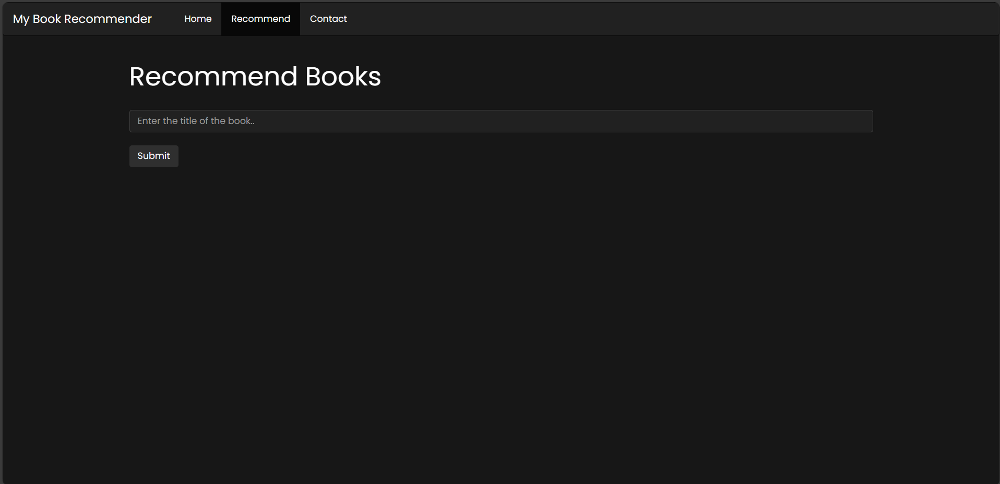
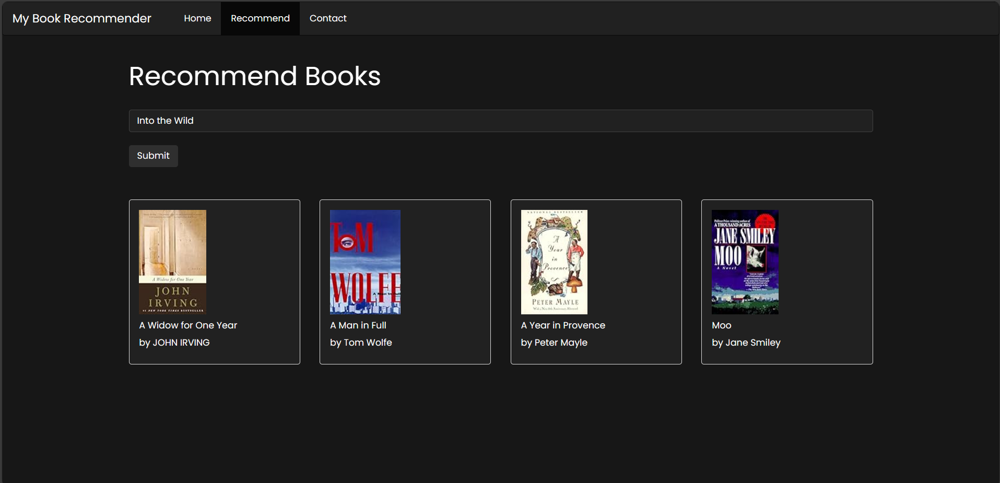

# Book Recommendation Web App
This project is a Flask-based web application that provides book recommendations using two different recommendation systems: Popularity Based Recommender System and Collaborative Filtering Based Recommender System.

## Dataset
The dataset used in this project is sourced from [Kaggle](https://www.kaggle.com/datasets/arashnic/book-recommendation-dataset). It contains information about books, users, and ratings.

## Website Screenshots
 <br> <br>
 <br> <br>
 <br>

## Setting Up

1. **Clone the Repository**: Clone this repository to your local machine.

    ```bash
    git clone https://github.com/your-username/book-recommendation-web-app.git
    ```

2. **Install Dependencies**: Navigate to the project directory and install the required dependencies.

    ```bash
    cd book-recommendation-web-app
    pip install -r requirements.txt
    ```

3. **Run the Flask App**: Execute the `app.py` script to run the Flask application.

    ```bash
    python app.py
    ```

4. **Access the Web App**: Open a web browser and go to `http://localhost:5000` to access the web application.

## About the Recommendation Systems

- **Popularity Based Recommender System**: This system recommends books based on their popularity, calculated by the number of ratings and average rating scores.
- **Collaborative Filtering Based Recommender System**: This system recommends books by finding similar books based on user ratings. It uses a cosine similarity approach to find books with similar ratings and recommends them to the user.

## Note

- Ensure that you have Python installed on your system.
- The provided `requirements.txt` file includes all necessary dependencies. You can install them using `pip`.
